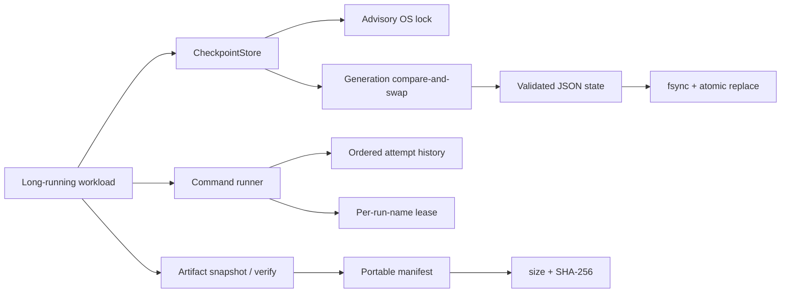
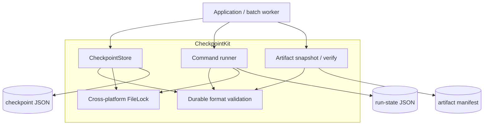

<div align="center">

# CheckpointKit

### Crash-resilient, local-first checkpointing and resume primitives for long-running Python jobs

**Recover work deliberately instead of blindly restarting it.**

[](https://github.com/jerry0327/checkpointkit/actions/workflows/ci.yml)
[](https://github.com/jerry0327/checkpointkit/actions/workflows/codeql.yml)
[](https://github.com/jerry0327/checkpointkit/releases)

[](LICENSE)


**[Quick start](#quick-start)** · **[Recovery contract](#recovery-contract)** · **[Crash evidence](#reproducible-crash--resume-evidence)** · **[Architecture](#architecture)** · **[Boundaries](#guarantees--boundaries)**

</div>

---

CheckpointKit is a small Python recovery toolkit for long-running **AI, data, media, OCR, transcription, evaluation, scraping, conversion, and batch workloads**.

It gives local jobs an explicit durable recovery layer without requiring a distributed scheduler:

```text
run → checkpoint → interruption → inspect → resume → verify
```

The core idea is deliberately narrow: **record enough durable state to know what already succeeded, detect conflicting writers, preserve command-attempt history, and verify produced artifacts after recovery.**

> [!IMPORTANT]
> CheckpointKit is workflow/application-level recovery software. It does **not** restore process memory or promise exactly-once behavior for arbitrary external side effects.

## Why CheckpointKit

| Failure / uncertainty | CheckpointKit behavior |
| --- | --- |
| Process dies after many completed items | Durable completion keys let the next run skip committed work |
| State write is interrupted | Temporary-file + fsync + atomic `os.replace` keeps the previous valid document in place |
| Two cooperating local writers race | Advisory OS lock serializes writes; monotonic generation detects stale snapshots |
| A wrapped command exits uncleanly | Previous `running` attempt becomes `abandoned`; a new ordered attempt is recorded |
| Output files drift after a run | SHA-256 artifact manifests detect missing, changed, or unexpected files |
| Durable JSON is truncated / malformed | Readers fail closed instead of silently resetting progress |
| Manifest path tries to escape its base | Validation rejects traversal, absolute paths, drive prefixes, and symlink escapes |

## Recovery contract

CheckpointKit combines several small primitives instead of pretending one mechanism solves every failure mode:



### Durable state mutation

A normal checkpoint mutation follows this sequence:

```text
acquire advisory lock
→ read + validate current state
→ compare durable generation
→ construct next generation
→ write temp file in destination directory
→ flush + fsync file
→ atomic os.replace
→ best-effort parent-directory fsync on POSIX
→ release lock
```

The two concurrency layers serve different purposes:

- **Lock** — serializes cooperating local read-modify-write transactions.
- **Generation token** — catches stale in-memory snapshots that are saved later.

A stale generation raises `StateConflictError`; newer durable progress is not overwritten.

## Quick start

Current release: **v0.3.0 (beta)**. Python **3.10–3.14** is supported.

Install the verified GitHub release wheel:

```bash
python -m pip install \
  https://github.com/jerry0327/checkpointkit/releases/download/v0.3.0/checkpointkit-0.3.0-py3-none-any.whl
```

Or install the tagged source:

```bash
python -m pip install \
  "checkpointkit @ git+https://github.com/jerry0327/checkpointkit.git@v0.3.0"
```

### Minimal Python usage

```python
from checkpointkit import CheckpointStore

store = CheckpointStore(".checkpointkit/transcribe.json")

for item in inputs:
    key = str(item.id)
    if store.is_complete(key):
        continue

    process(item)
    store.mark_complete(key, {"output": f"out/{key}.json"})
```

High-level mutations lock, reload, validate, update, and atomically install the next generation. Explicit read-modify-write users can call `load()` and conditional `save()`; stale generations fail with `StateConflictError` instead of silently replacing newer state.

## CLI

Wrap a command and record its attempts:

```bash
checkpointkit run --name transcribe -- python pipeline.py
checkpointkit status --name transcribe
checkpointkit list
checkpointkit resume --name transcribe
```

A completed named command is not rerun unless `--force` is supplied.

Per-name lock wait is configurable:

```bash
checkpointkit run \
  --name transcribe \
  --lock-timeout 30 \
  -- python pipeline.py
```

### Artifact snapshot + verification

```bash
checkpointkit snapshot output/ --manifest artifacts.json
checkpointkit verify artifacts.json
checkpointkit verify artifacts.json --exact --json
```

Normal verification checks:

- file exists
- byte size matches
- SHA-256 matches

`--exact` additionally reports files that appeared under the original snapshot roots after the manifest was created.

## Reproducible crash + resume evidence

The repository contains a deterministic offline recovery demonstration that kills a **real child process** after a controlled number of durable commits, then resumes it in a new process.

```bash
python examples/crash_resume_demo.py \
  --workspace .checkpointkit-demo \
  --reset
```

The CI recovery scenario is configured for **16 items** and terminates after **5 durable commits**.

For the scenario to pass, the recovery report must prove all of the following:

```mermaid
flowchart LR
    A["16 deterministic inputs"] --> B["Worker starts"]
    B --> C["5 durable commits"]
    C --> D["Real child-process termination"]
    D --> E["New process resumes"]
    E --> F["5 committed items skipped"]
    F --> G["11 remaining items processed"]
    G --> H["0 committed items duplicated"]
    H --> I["Recovered SHA-256 manifest == clean run"]
```



The generated machine-readable report captures:

- committed / skipped / resumed counts
- duplicate-processing evidence
- checkpoint generation history
- clean vs recovered runtimes
- platform + Python runtime metadata
- exact artifact verification results
- paths to the evidence bundle

CI runs the scenario independently on **Linux, Windows, and macOS** and uploads each evidence directory as a workflow artifact. The package job depends on all three recovery jobs.

See [`docs/recovery-demo.md`](docs/recovery-demo.md) and [`docs/recovery-report.schema.json`](docs/recovery-report.schema.json).

## Architecture

CheckpointKit intentionally keeps the runtime core small and dependency-free.



### Core modules

| Module | Responsibility |
| --- | --- |
| `store.py` | item-level completion state, atomic JSON writes, generations, conditional saves |
| `locking.py` | POSIX `flock` / Windows `msvcrt` advisory locks with timeout |
| `runner.py` | named command attempts, per-name leases, resume and stale-attempt recovery |
| `artifacts.py` | portable manifests, SHA-256 snapshots, normal / exact verification |
| `_validation.py` | stable validation of JSON types, timestamps and safe relative paths |
| `cli.py` | `run`, `resume`, `status`, `list`, `snapshot`, `verify` commands |
| `errors.py` | public operational exception hierarchy |

## Local concurrency semantics

For tested ordinary local filesystems, cooperating processes use both:

1. a one-byte sidecar advisory lock;
2. a monotonic `generation` checked before replacement.

Example:

```text
.checkpointkit/transcribe.json
.checkpointkit/.transcribe.json.lock
```

A successful durable write increments generation exactly once. Idempotent mutations that make no change do not write and do not increment it.

The command runner holds its per-run-name lease for the **entire child-process lifetime**, so two cooperating wrappers cannot simultaneously start the same named run.

Read the full contract in [`docs/concurrency.md`](docs/concurrency.md).

## Artifact integrity

Snapshot manifests store portable relative paths plus:

```json
{
  "path": "output/item-0001.json",
  "size": 1234,
  "sha256": "…"
}
```

Manifest validation rejects unsafe or ambiguous paths before verification:

- absolute paths
- Windows drive prefixes
- `..` traversal where not explicitly permitted
- duplicate file records
- malformed SHA-256 digests
- resolved paths / symlinks that escape the declared base directory

This makes artifact verification useful as a recovery **evidence layer**, not just a convenience checksum command.

## CI + release evidence

The CI gate is materially stronger than a single unit-test job:

| Gate | Coverage |
| --- | --- |
| Ruff + compileall | source / tests / examples / tools |
| Python matrix | 3.10, 3.11, 3.12, 3.13, 3.14 on Linux |
| Cross-platform | current Python on Linux, Windows, macOS |
| Coverage | branch-aware, minimum **90%** |
| Recovery evidence | real crash-and-resume scenario on all 3 OS families |
| Packaging | sdist + wheel build + clean wheel install smoke test |
| Security | CodeQL on PRs, main pushes and scheduled scans |

### Release provenance

Release publication only proceeds from a **successful CI run on `main`**. The release workflow:

1. checks out the exact successful commit;
2. verifies `main` has not advanced;
3. refuses to overwrite an existing tag;
4. builds wheel + sdist;
5. writes `SHA256SUMS`;
6. generates GitHub build-provenance attestations;
7. creates the GitHub release from that exact SHA.

Verify a published release with GitHub CLI:

```bash
gh release verify v0.3.0 -R jerry0327/checkpointkit

gh attestation verify checkpointkit-0.3.0-py3-none-any.whl \
  --repo jerry0327/checkpointkit
```

## Guarantees + boundaries

CheckpointKit intentionally documents what it **does not** guarantee.

### Covered local contract

- interrupted / failed state writes preserve the previous valid document
- malformed durable state is rejected rather than silently reset
- cooperating local writers do not silently lose updates
- stale in-memory snapshots are rejected
- unclean command attempts become inspectable / recoverable attempt history
- artifact drift can be detected by size / SHA-256 / exact-tree verification

### Not claimed

- process-memory restoration
- exactly-once arbitrary external side effects
- distributed locking
- coordination on NFS / SMB / object-store mounts / synced folders
- safety against hostile writers with state-directory write access
- durability after filesystem or storage-device corruption

A remote API call may succeed immediately before local power loss. CheckpointKit cannot infer whether that side effect should be repeated; irreversible external operations still need domain-level idempotency keys or transactions.

See [`docs/failure-model.md`](docs/failure-model.md).

## Development

```bash
git clone https://github.com/jerry0327/checkpointkit.git
cd checkpointkit
python -m venv .venv
# activate .venv
python -m pip install -e ".[dev]"
```

Run the local quality gates:

```bash
ruff check .
python -m compileall -q src tests examples tools
pytest --cov=checkpointkit --cov-report=term-missing --cov-branch
```

## Repository anatomy

```text
src/checkpointkit/      dependency-free runtime package
├── store.py
├── runner.py
├── locking.py
├── artifacts.py
├── _validation.py
├── cli.py
└── errors.py

tests/                  store / runner / lock / CLI / artifact / validation tests
examples/               resumable batches, concurrent writers, crash-resume demo
docs/                   architecture, formats, concurrency, failure model, evidence
.github/workflows/       CI, CodeQL, release automation
release/                 explicit release intent
```

## Documentation map

- [`docs/architecture.md`](docs/architecture.md) — component map and durability sequence
- [`docs/checkpoint-format.md`](docs/checkpoint-format.md) — durable JSON contracts
- [`docs/concurrency.md`](docs/concurrency.md) — local multi-writer semantics
- [`docs/failure-model.md`](docs/failure-model.md) — guarantees and explicit exclusions
- [`docs/recovery-demo.md`](docs/recovery-demo.md) — crash-and-resume evidence scenario
- [`docs/project-evidence.md`](docs/project-evidence.md) — verified project claims vs adoption claims
- [`docs/releasing.md`](docs/releasing.md) — release process and verification

## Project status

CheckpointKit is an early open-source project, currently **0.3.0 beta**. Durable formats remain pre-1.0 and may evolve with documented migration notes.

The project deliberately does **not** claim broad adoption, production deployment, external-contributor scale, or download volume without independent evidence.

## Contributing, governance + security

- [`CONTRIBUTING.md`](CONTRIBUTING.md)
- [`GOVERNANCE.md`](GOVERNANCE.md)
- [`CODE_OF_CONDUCT.md`](CODE_OF_CONDUCT.md)
- [`SUPPORT.md`](SUPPORT.md)
- [`SECURITY.md`](SECURITY.md)
- [`ROADMAP.md`](ROADMAP.md)

AI-assisted contributions are reviewed under the same correctness, licensing, security, and testing standards as other contributions.

## License + citation

**Apache License 2.0.** See [`LICENSE`](LICENSE).

Citation metadata is provided in [`CITATION.cff`](CITATION.cff).

---

<div align="center">

### Checkpoint what finished. Resume what did not. Verify what came out.

</div>
